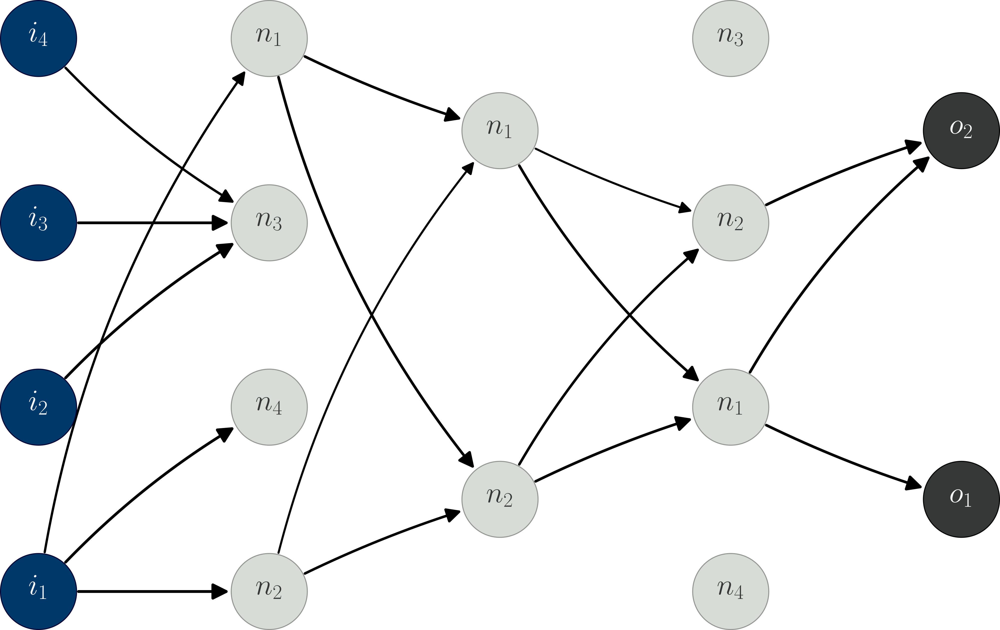

Nemoa
=====

*Nemoa* is a data analysis framework for collaborative data science and
enterprise application. Nemoa is open source and based on the `Python`_
programming language.

Introduction
------------

In many domains of enterprise and scientific data analysis the lack of
structural knowledge encourages the use of machine intelligence methods, which
surpass the structural flexibility of classical statistical methods. Since this
approach, however, generally is paid by high mathematical uncertainty, it is
indispensable to properly choose and adapt the method to it's respective
application. This requires a close cooperation between enterprise analytics and
data science.

The key goal of nemoa is to provide a long-term data analysis framework, which
seemingly integrates into existing enterprise data environments and thereby
supports collaborative data science. To achieve this goal nemoa orchestrates
established frameworks like `TensorFlow®`_ and `SQLAlchemy`_ and dynamically
extends their capabilities by community driven algorithms for probabilistic
graphical modeling [PGM]_, machine learning [ML]_ and structured data-analysis
[SDA]_.

Components
----------

Nemoa provides:

    * A transparent `DW`_ architecture for the seamless integration of existing
      SQL databases, flat data from laboratory measurement devices or data
      generators.
    * A versatile and fast data modeling and data analysis framework.

.. toctree::
   :maxdepth: 3
   :caption: Contents:

   Installation <install>
   Glossary <glossary>
   License <license>
   Bibliography <bibliography>

Indices and tables
==================

* :ref:`genindex`
* :ref:`modindex`
* :ref:`search`

.. References:
.. _Python: https://www.python.org/
.. _DW: https://en.wikipedia.org/wiki/Data_warehouse
.. _SQLAlchemy: https://www.sqlalchemy.org/
.. _TensorFlow®: https://www.tensorflow.org/
